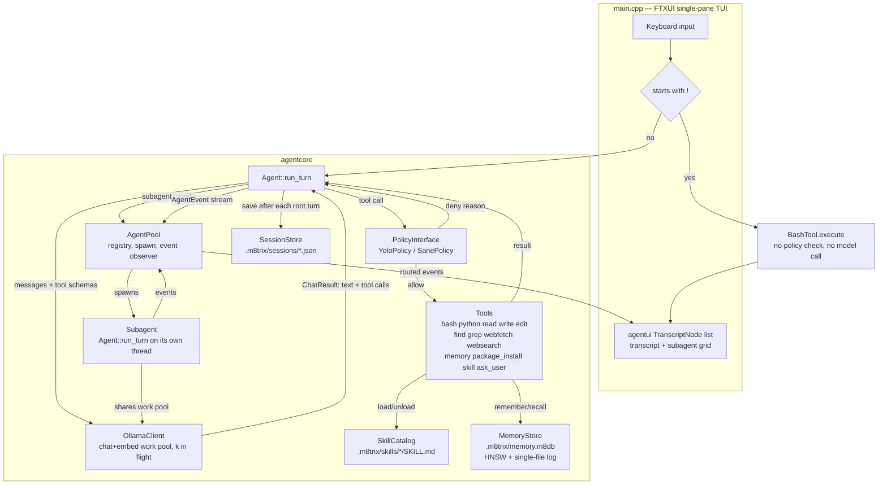
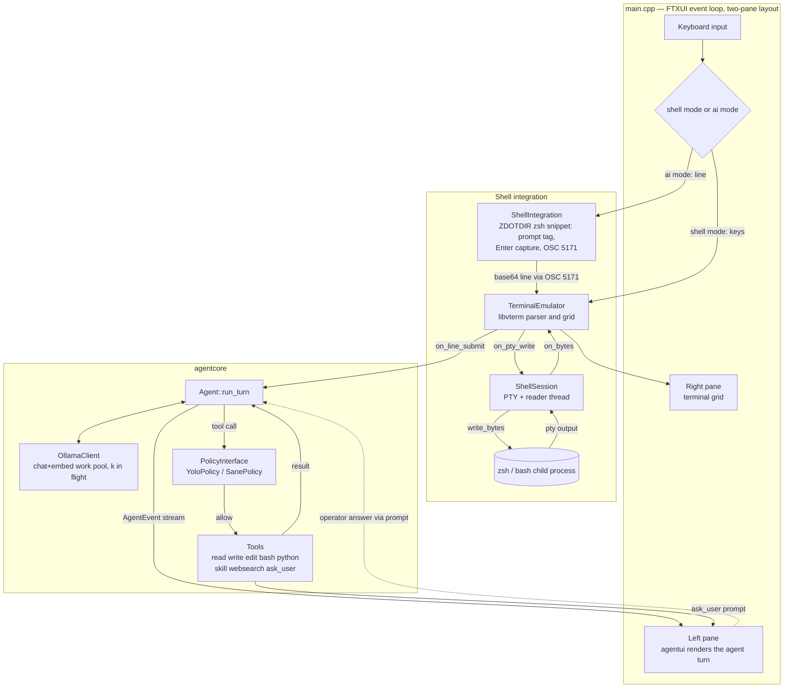
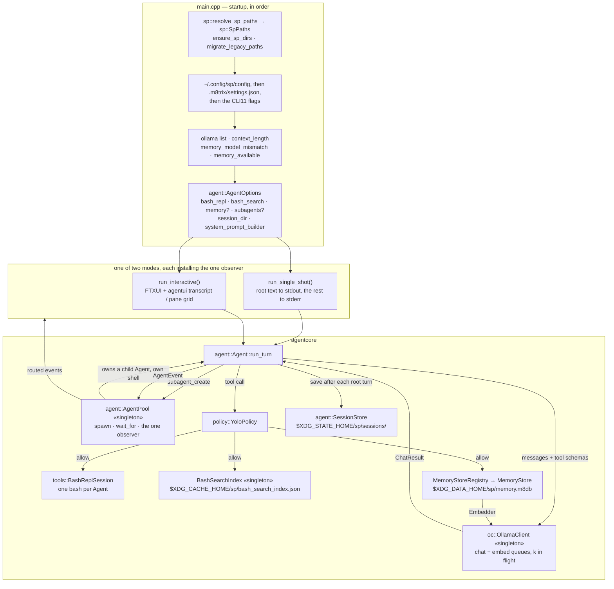
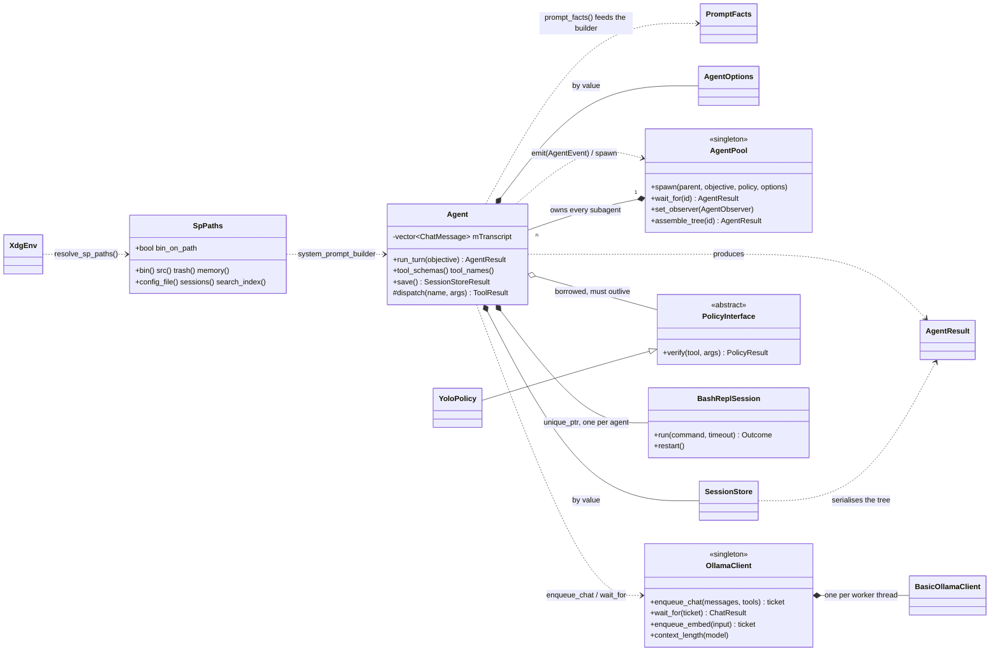
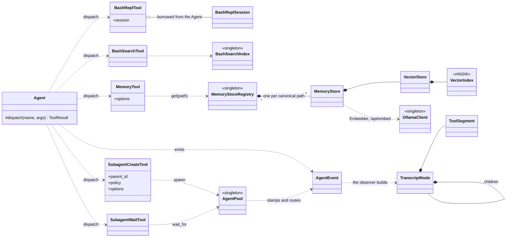

# m8trixparrot

Experiments in building AI agents in C++ on top of local Ollama models,
with terminal UIs built on [FTXUI](https://github.com/ArthurSonzogni/FTXUI).

## Layout

```
.
├── CMakeLists.txt          top-level build: fetches deps, adds src/
├── Makefile                convenience wrapper around cmake/make
└── src/
    ├── core/                shared library (agentcore), one dir per component
    │   ├── util/            json_util, uuid — depends on nothing
    │   ├── oc/              Ollama HTTP clients and the work pool
    │   ├── tools/           the tools, plus bash_repl/shell_session/installer
    │   ├── policy/          PolicyInterface, YoloPolicy, SanePolicy
    │   ├── vdb/             vector index/store, memory store, the .m8db format
    │   ├── agent/           Agent, AgentPool, sessions, skills, prompts
    │   └── CMakeLists.txt
    ├── common/              agentui: the shared FTXUI transcript view
    └── apps/                one subdirectory per agent experiment
        ├── CMakeLists.txt   registers each experiment
        └── chat_tui/        first experiment: minimal FTXUI chat against Ollama
            ├── main.cpp
            └── CMakeLists.txt
```

`src/core/` is one library, `agentcore`, but it is six components with six
namespaces — `util`, `oc`, `tools`, `policy`, `vdb`, `agent` — and the
dependencies between them run one way only:

```
util  ← oc, tools, policy, vdb, agent      (json_util, generate_uuid_v4)
tools ← policy, vdb, agent
oc    ← vdb, agent
policy, vdb ← agent
```

`agent` sits on top and may use anything; `util` sits at the bottom and uses
nothing. `agent` depending on `tools` is not an accident — `Agent::dispatch`
constructs every tool. Two files are named for where they are *called* rather
than where they are declared, and live with their declarations: the `memory`
tool is `vdb/memory_tool.cpp` because `MemoryTool` is declared in
`memory_store.h`, and the subagent tools are `agent/subagent_tool.cpp` because
they are declared in `agent.h` and call `AgentPool`. Filing them under `tools/`
is what used to make the graph cyclic.

Every experiment is its own executable target under `src/apps/<name>/`,
linked against the shared `agentcore` library. All built executables are
placed directly in `build/` (e.g. `build/chat_tui`) regardless of how deep
their source lives, so they're easy to find and run.

Communication with Ollama happens over HTTP via libcurl
(`src/core/oc/ollama_client.{h,cpp}`), talking to Ollama's REST API
(`/api/chat`) with JSON bodies parsed via
[nlohmann/json](https://github.com/nlohmann/json).

## Adding a new experiment

1. Create `src/apps/<name>/` with a `main.cpp` and a `CMakeLists.txt`
   (copy `src/apps/chat_tui/CMakeLists.txt` as a starting point).
2. Add `add_subdirectory(<name>)` to `src/apps/CMakeLists.txt`.
3. `make build` — the new binary appears at `build/<name>`.

## Build

Dependencies: a C++20 compiler, CMake, `libcurl`, `libgit2`, and (for the
`m8trixsh` app only) `libvterm` — all system-provided; on macOS
`brew install libgit2 libvterm`. FTXUI, simdjson, pybind11, and CLI11 are
fetched automatically by CMake via `FetchContent`. When `libvterm` is absent
the build still works, it just skips `m8trixsh`.

```sh
make build       # configure (if needed) + build everything into build/
make run APP=chat_tui   # build, then run a specific app
make clean        # remove the build directory
make rebuild       # clean + build
```

Or drive CMake directly:

```sh
cmake -S . -B build -DCMAKE_BUILD_TYPE=Release
cmake --build build -j
```

## Running chat_tui

Requires a running [Ollama](https://ollama.com) server with a pulled model:

```sh
ollama pull llama3.2
build/chat_tui llama3.2                       # positional: model name
build/chat_tui --model llama3.2 --history /tmp/chat.txt  # named flags
build/chat_tui --help                         # list all options
```

Type a message and press Enter to send it; type `/quit` to exit.

## m8trixparrot

`m8trixparrot` is the coding agent this repo is named after: a single-pane
FTXUI chat TUI in front of a multi-step Ollama agent that can call tools
(`bash`, `python`, `read`/`write`/`edit`, `find`/`grep`, `webfetch`,
`websearch`, `memory`, `package_install`, `skill`, `ask_user`) and spawn subagents for
independent subtasks. A line starting with `!` bypasses the agent entirely and
runs as a shell command (e.g. `!ls -al`).

### Architecture



A turn starts when the user submits a line that doesn't start with `!`:
`Agent::run_turn` loops model calls against `OllamaClient`'s work pool,
gates each returned tool call through `PolicyInterface` before dispatching
it, and stops once the model replies with no more tool calls. Every step
emits an `AgentEvent` through the shared `AgentPool`, which stamps
agent/parent/depth and routes it to the app's `agentui::TranscriptNode` list.
Calling the `subagent_create` tool spawns another `Agent` on its own thread —
sharing the same `OllamaClient` pool, so however many agents are live, no more
than `k` requests are ever in flight against Ollama — whose events nest under
the parent in the transcript until `subagent_wait` joins it.
The root agent's result tree (not the full transcript) is saved to
`SessionStore` after each turn — to `.m8trix/sessions/` under the working
directory, except for `sp`, which points `AgentOptions::session_dir` at
`$XDG_STATE_HOME/sp/sessions/` so that running it from an arbitrary directory
does not leave files there.

## Running m8trixsh

`m8trixsh` is an intelligent shell. It runs zsh in a VT100/xterm pane (colours,
`vim`, `htop`, `ssh`, job control) and adds an **AI mode** on the side. You
always type at the one shell prompt; a `[shell]` / `[m8trx]` tag on that prompt
shows where **Enter** goes, and **Shift+Tab** toggles it:

- **shell mode** (default): the line runs in the shell, exactly like a terminal.
- **ai mode**: the line goes to an Ollama agent that can `read`/`write`/`edit`
  files and run `bash`, and does not run in the shell. For anything that
  changes files the agent researches first, proposes a plan (which you answer
  at the prompt — the tag turns to `[m8trx?]`), writes a script into `~/bin`,
  asks you to approve it, then runs it. Toggle back to `[shell]` any time — the
  agent keeps working, and the AI pane pops open when it needs an answer.

```sh
brew install libvterm          # one-time prerequisite for this app
make run APP=m8trixsh           # or: build/m8trixsh --model qwen3.8:27b-mlx
```

The agent's replies and tool calls show in the left pane, which collapses to a
thin strip when there is no AI activity. `Ctrl+Alt+J`/`K` scroll it,
`Ctrl+Alt+H`/`L` resize it, `Ctrl+Alt+F` folds every tool call (all in ai
mode). The permission policy defaults to `yolo` — your approval of each script
before it runs is the safety gate; `--policy sane` confines writes to the
working directory and `/tmp`.

m8trixsh installs its own prompt and Enter-capture into a throwaway `ZDOTDIR`
that sources your real `~/.zshrc` first, so your aliases, `PATH`, and functions
still work. **The mode tag and ai-mode capture need zsh**; with a non-zsh
`$SHELL` the pane still works but stays in shell mode. AI-mode lines are never
added to your shell history.

Unlike `m8trixparrot`, `m8trixsh` reads its defaults from **`~/.m8shrc`** — a
shell-env-style file, one `KEY=VALUE` per line (`#` comments, optional `export`
and surrounding quotes). A CLI flag always overrides it.

```sh
# ~/.m8shrc
MODEL=qwen3.8:27b-mlx
POLICY=sane
ENABLE_WEB_SEARCH=1
SHELL=/bin/zsh
MODE_SWITCH_KEY=ctrl-o        # shift-tab (default) | tab | ctrl-] | ctrl-o | ctrl-\ | f12
PROMPT_FORMAT='%tag %F{green}➜%f  %F{cyan}%~%f %F{yellow}%git%f '
PROMPT_AI_TAG='%F{magenta}[m8trx]%f'
```

Recognized keys: `MODEL`, `POLICY`, `MAX_STEPS`, `NUM_CTX`, `SUMMARIZE_AT`,
`OLLAMA_JOBS`, `SKILLS_DIR`, `ENABLE_SKILLS`, `ENABLE_SUBAGENTS`,
`ENABLE_PACKAGE_INSTALL`, `ENABLE_WEB_SEARCH`, `SHELL`, `MODE_SWITCH_KEY`,
`PROMPT_FORMAT`,
`PROMPT_SHELL_TAG`, `PROMPT_AI_TAG`, `PROMPT_ASK_TAG`. `MODE_SWITCH_KEY` rebinds
the shell/ai toggle; the default `shift-tab` matches any backtab (Shift+Tab, and
Ctrl/Opt+Shift+Tab where the terminal forwards one), which shadows zsh's
reverse-menu-complete while the toggle is live. `PROMPT_FORMAT` is the prompt
m8trixsh installs — ordinary zsh prompt syntax, with `%tag` (the
`[shell]`/`[m8trx]`/`[m8trx?]` indicator) and `%git` (a branch segment) added;
the `PROMPT_*_TAG` keys set what `%tag` expands to in each mode.

### Architecture



Shell-mode keystrokes go straight from `TerminalEmulator` to the `zsh` child
through `ShellSession`'s PTY, with `TerminalEmulator` parsing the output back
into a renderable grid. Ai-mode lines are instead captured by the zsh snippet
`ShellIntegration` installs (via a custom Enter binding that emits an OSC 5171
escape sequence), decoded by `TerminalEmulator`, and handed to the `Agent`,
which loops against `OllamaClient` and dispatches tool calls through
`PolicyInterface` before they run. The `ask_user` tool reuses the same prompt
to park the agent thread until the operator answers.

## Running shell-parrot (sp)

`sp` is a natural-language shell assistant: describe a task in plain English
and it runs the shell commands to carry it out. Its whole tool set is
`bash_repl` — one shell that stays alive across calls, so a variable it sets or
a directory it `cd`s into is still there on the next one — plus `bash_search`,
`memory`, and the two subagent tools. No python, no skills. It **never deletes
anything**: unwanted files are moved to `$XDG_DATA_HOME/sp/trash/`.

`sp` delegates. A task that splits into parts which don't need each other's
output — three directories to audit, four archives to verify — is handed to
subagents with `subagent_create`, one per part, and collected with
`subagent_wait`. Each subagent is another `sp` agent with **its own `bash_repl`
shell** and **its own chat history**, so it cannot see the parent's variables,
its `cd`, or anything the parent said; the objective string is all it gets,
which is why the prompt insists every path in one be absolute. A subagent may
delegate in turn, up to `--max-depth` (default 3), with `--max-agents` (default
8) live at once. `--no-subagents` turns the whole thing off.

All the agents share one `memory` database, but only the root writes to it: a
subagent recalls freely and reports anything worth keeping as a `MEMORY:` line
in its final message, which the root then stores. Several agents writing
concurrently could not keep the one-memory-per-subject rule, because none of
them can see what the others just stored.

When a task produces something worth keeping, sp installs it as a real command:
executable, named without an extension, with a `--help` and arguments instead
of this run's values hardcoded. sp's closing message tells you the path and how
to run it, plus the `PATH` line to add if you have not already.

Everything sp owns lives in the XDG base directories, so it can be found,
backed up or deleted as a unit:

| Path | Holds |
|---|---|
| `$XDG_DATA_HOME/sp/bin/` | commands sp installs — **add this to your `PATH`** |
| `$XDG_DATA_HOME/sp/src/` | C++ and script sources it keeps |
| `$XDG_DATA_HOME/sp/trash/` | files it was asked to delete |
| `$XDG_DATA_HOME/sp/memory.m8db` | long-term memory |
| `$XDG_CONFIG_HOME/sp/config` | settings (see below) |
| `$XDG_STATE_HOME/sp/sessions/` | one JSON result tree per turn |
| `$XDG_CACHE_HOME/sp/bash_search_index.json` | the `bash_search` command index |

`bash_search` serves that index from the cache immediately — a few
milliseconds — and refreshes it on a background thread, so a command you
installed since the last run shows up without anyone paying for the rebuild.
Only the very first use on a machine, when there is no cache to serve, waits
for the scan (about a second, nearly all of it one `apropos` call). Deleting
the file is always safe; it is rebuilt on next use.

The defaults are `~/.local/share`, `~/.config`, `~/.local/state` and `~/.cache`;
each `$XDG_*_HOME` is honoured when set to an absolute path. Add the bin
directory once:

```sh
export PATH="$HOME/.local/share/sp/bin:$PATH"
```

Upgrading from an earlier version moves `~/.local/sp_development` and `~/.sprc`
into the new layout automatically, printing what it moved. Commands already
installed in `~/.local/bin` or `~/bin` are left alone and keep working.

```sh
build/sp 'move all .log files in /tmp to ~/Downloads'
build/sp 'find the five largest files under ~/Documents'
build/sp -i                  # interactive TUI
build/sp                     # same — no prompt means interactive
```

Single-shot mode prints **the root agent's** text to stdout and one
`[tool: summary]` progress line per call to stderr, so a script can pipe it.
Subagent activity is stderr only, indented by depth and tagged `[d1 …]`, with a
`[subagent <id> started|done]` line around each one — so a delegating task still
leaves nothing but the answer on stdout.

Interactive mode is the same transcript view the other TUIs use, with `/help`,
`/reset` and `/quit`. While subagents are running the transcript is replaced by
a grid of live panes, one per subagent, and the header reads
`subagents: 2/8  |  ctx: 12k/160k`; `Ctrl+G` swaps the grid for the transcript
and back. When the turn ends each subagent folds into a one-line block under the
agent that spawned it — click it to read what it did, or `Ctrl+T` to fold and
unfold everything.

Defaults come from `$XDG_CONFIG_HOME/sp/config` — `~/.config/sp/config` — in
the shell-env format `~/.m8shrc` uses: one `KEY=VALUE` per line, `#` comments;
keys `MODEL`, `MAX_STEPS`, `NUM_CTX`, `SUMMARIZE_AT`, `OLLAMA_JOBS`,
`ENABLE_SUBAGENTS`, `MAX_DEPTH`, `MAX_AGENTS`, `ENABLE_MEMORY`, `MEMORY_PATH`,
`MEMORY_EMBED_MODEL`. Then `./.m8trix/settings.json` where one
exists, then the command line — each winning over the one before it. `sp` is
run from wherever the user happens to be standing, so the config file is what
actually persists a setting. An older `~/.sprc` is moved here on first run.

### Architecture



`sp` is the same `Agent` the other two apps run, configured differently and
wrapped in about 1100 lines of `main.cpp`. Startup order is deliberate: paths
resolve before anything reads a config, and the embedding probe runs last
because it is a second call to the same Ollama the model check just used
(`main.cpp:1017-1046`). `tools::set_bash_search_index_path(paths.search_index())` at
`main.cpp:895` is what moves the command index off the shared `~/.m8trix` one,
so sp leaves nothing behind in a directory it was merely run from.

sp constructs exactly one object of its own: the root `agent::Agent`, on
`main`'s stack (`main.cpp:1110`). `OllamaClient` and `AgentPool` are singletons
it only configures — `set_concurrency`, `configure`, `configure_embed`,
`AgentPool::configure` — and every subagent is built by `AgentPool::spawn`,
which owns it through a `unique_ptr` in its node.

There is no tool registration step. sp sets nine booleans on `AgentOptions`
(`main.cpp:1069-1103`) and `Agent::tool_schemas()` turns them into the
advertised list: `bash_repl`, `bash_search`, then `memory` when it is on, then
`subagent_create` and `subagent_wait`. `enable_bash_repl` *replaces* `bash`
rather than adding to it, which is why sp has one shell rather than two ways to
run a command.

Both modes are one `AgentPool` observer and nothing more. Single-shot's
(`main.cpp:139`) prints root `Assistant` text to stdout and everything else
depth-indented to stderr. Interactive's (`main.cpp:247`) routes each event by
`ev.agent_id` through an `unordered_map<string, list<TranscriptNode>*>`, so a
subagent's output nests under the node that spawned it instead of piling into
one column. `AgentPool::emit` holds its observer mutex across the whole
callback, which is why the single-shot writer needs no lock of its own.

Each subagent is a whole `Agent`, so it gets its own `BashReplSession` — the
code-level reason a delegated task cannot see the parent's variables or its
`cd`. `Agent::save()` goes through `AgentPool::assemble_tree()`, which blocks on
every descendant, so the root's session file is never written while a subagent
is still running.

### Classes

Two views of the same set: what owns what at runtime, then how a tool call
reaches the thing that does the work.





**sp's own types** — `src/apps/sp/`. Only four, because nearly everything else
in the app is a free function.

| Type | File | Role |
|---|---|---|
| `sp::XdgEnv` | `sp_paths.h:14` | The four raw `$XDG_*_HOME` strings, read by `main()` and passed in, so resolving paths stays a pure function a test can drive |
| `sp::SpPaths` | `sp_paths.h:24` | Every location sp owns, one accessor per purpose: `bin()`, `src()`, `trash()`, `memory()`, `config_file()`, `sessions()`, `search_index()`, plus `bin_on_path` |
| `sp::Command` | `sp_memory.h:18` | One line of TUI input, classified; the nested `Kind` covers `/quit` `/help` `/reset` `/remember` `/memories` `/forget` |
| `MemoryConfig` | `main.cpp:120` | Anonymous namespace. `enabled` plus the `MemoryOptions` that both the `memory` tool and the slash commands open the store through |

The rest of `src/apps/sp/` is functions: `resolve_sp_paths`, `ensure_sp_dirs`
and `migrate_legacy_paths` (`sp_paths.cpp`); `make_system_prompt`, one builder
serving both altitudes off `facts.is_root()` (`sp_prompt.cpp:7`);
`parse_command`, `do_remember`, `do_search`, `do_forget` (`sp_memory.cpp`); and
the two modes, `run_single_shot` (`main.cpp:139`) and `run_interactive`
(`main.cpp:196`), which are functions rather than classes — all their state is
locals under one `std::mutex`.

**The agent runtime** — `src/core/agent/`

| Type | File | Role |
|---|---|---|
| `agent::Agent` | `agent.h:210` | The turn loop. One type for root and subagents; the root is the one at depth 0 that persists |
| `agent::AgentOptions` | `agent.h:70` | Every knob, copied by value into each subagent — including the prompt builder |
| `agent::AgentEvent` | `agent.h:36` | One thing that happened, with a `Kind` of `Assistant`, `ToolCall`, `ToolResult`, `Denied`, `Error`, `Notice`, `SubagentStart`, `SubagentDone`, `ContextUsage`, `ContextSummarized` |
| `agent::AgentObserver` | `agent.h:68` | `std::function<void(const AgentEvent&)>` — the only callback typedef in the runtime |
| `agent::AgentResult` | `agent_result.h:18` | Recursive; the root's copy is the whole tree, and it is what a session file holds |
| `agent::SpawnResult` | `agent_result.h:31` | What `subagent_create` gets back |
| `agent::AgentPool` (+ private `Node`) | `agent_pool.h:29`, `:73` | Registry of every agent, the spawn/depth caps, and the single process-wide observer |
| `agent::SessionStore` | `session_store.h:30` | Writes the result tree; owned by value by each `Agent`, a no-op below depth 0 |
| `agent::SessionRecord` / `SessionResult` / `SessionStoreResult` | `session_store.h:13`, `:18`, `:24` | What a session file is, and the two result types around it |
| `policy::PolicyResult` (+ `Decision`) | `policy.h:17` | Allow or deny, with a reason the model reads |
| `policy::PolicyInterface` | `policy.h:39` | Abstract; borrowed by `Agent` and passed by reference into every child |
| `policy::YoloPolicy` | `policy.h:66` | Allows everything. The only policy sp instantiates (`main.cpp:1107`) |
| `agent::PromptFacts` | `system_prompt.h:23` | The whole contract between core and an app's prompt builder |

**Talking to Ollama** — `src/core/oc/`

| Type | File | Role |
|---|---|---|
| `oc::OllamaClient` (+ private `Target`, `ChatJob`, `EmbedJob`) | `ollama_client.h:41`, `:106`, `:120`, `:128` | The work pool. Two queues, embeddings served first, `k` in flight; `/api/show` skips it |
| `oc::BasicOllamaClient` (+ `HttpResult`) | `basic_ollama_client.h:123`, `:152` | Synchronous libcurl client. One per pool worker; never used directly by an app |
| `oc::ChatMessage` | `basic_ollama_client.h:26` | The transcript element — there is no `Transcript` class, just `vector<ChatMessage>` on the `Agent` |
| `oc::ToolCall` | `basic_ollama_client.h:21` | Name plus raw JSON arguments, as the model returned them |
| `oc::ChatResult` | `basic_ollama_client.h:36` | Reply text, tool calls, and the `prompt_eval_count` that drives context tracking |
| `oc::EmbedResult` / `ShowResult` / `ModelDetails` | `basic_ollama_client.h:82`, `:101`, `:92` | Embeddings, and the `/api/show` capabilities the memory probe greps for `"embedding"` |

**sp's five tools** — paths relative to `src/core/`. A tool is a plain struct with no base class; the ones that
need context take it as an aggregate member filled in at the dispatch site.

| Type | File | Role |
|---|---|---|
| `tools::BashReplTool` | `tools/tools.h:106` | Borrows the session; a non-zero exit or a timeout is output, not tool failure |
| `tools::BashReplSession` (+ `Outcome`) | `tools/bash_repl.h:28`, `:35` | One `bash --norc --noprofile` over pipes, not a pty. A per-session sentinel marker carries `$?` and `$PWD` back; commands are staged through a temp file so an unterminated quote cannot wedge it |
| `tools::BashSearchTool` | `tools/tools.h:234` | `list_tags`, `search` over a boolean tag expression, `scan` |
| `BashSearchIndex`, `CommandEntry`, `ManPageLine`, `TagExpr`, `TagQueryParser` | `tools/tools_bash_search.cpp:571`, `:44`, `:291`, `:452`, `:475` | File-local. The singleton serves the cache and rescans on a worker it joins rather than detaches; one `apropos .` dump, not one `whatis` per command |
| `vdb::MemoryTool` | `vdb/memory_store.h:224` | `remember` / `recall` / `forget`. Declared beside `MemoryOptions` rather than in `tools.h` |
| `agent::SubagentCreateTool` / `SubagentWaitTool` | `agent/agent.h:183`, `:192` | Carry the spawning agent's identity into `AgentPool::spawn`; a cap refusal comes back as a tool error so the model does the work itself |
| `tools::ToolArgValue` / `ToolArgs` / `ToolResult` | `tools/tools.h:23`, `:30`, `:64` | The shared vocabulary. Tools never parse JSON — `tools::args_from_json()` (`tools/tools_util.h:61`) is the one seam |

**The memory stack** — `src/core/vdb/`, bottom-up. Only `MemoryTool` and the registry are
sp-facing; the three layers below have no idea an agent exists.

| Type | File | Role |
|---|---|---|
| `vdb::VectorIndex` (+ `IndexParams`, `Metric`, `Neighbor`, `LabelPredicate`) | `vector_index.h:68`, `:41`, `:13`, `:54`, `:62` | The HNSW graph, with NEON kernels. No I/O and no locking — `VectorStore` holds the lock, which is what lets this file be tested standalone |
| `vdb::VectorStore` (+ `Schema`, `Filter`, `Document`, `ScoredDoc`, `StoreOptions`, `StoreOpenResult`) | `vector_store.h:222`, `:45`, `:110`, `:62`, `:68`, `:153`, `:197` | One file per collection: duplicated header, append-only checksummed log, graph snapshot on flush. Caller-supplied `vector<float>`, no network dependency |
| `vdb::MemoryStore` (+ `Memory`, `RecallQuery`, `ScoredMemory`, `MemoryOptions`, `MemoryStats`) | `memory_store.h:164`, `:70`, `:81`, `:94`, `:101`, `:128` | Text in, ranked memories out. Owns the `Embedder` and embeds outside its own lock |
| `vdb::Embedder` + `vdb::ollama_embedder()` | `memory_store.h:50`, `:62` | The single network boundary of the memory system |
| `vdb::MemoryStoreRegistry` | `memory_store.h:204` | One open store per canonical absolute path, so the agent's tool and sp's slash commands share a file rather than two stale views of it |
| `vdb::ByteReader`, `crc32c()` | `byte_io.h:54`, `:105` | The `.m8db` record format |

**The view layer** — `src/common/transcript_view.h`, namespace `agentui`,
shared with `m8trixparrot` and `m8trixsh`.

| Type | File | Role |
|---|---|---|
| `agentui::ToolSegment` | `transcript_view.h:32` | One tool call, its output and its fold state |
| `agentui::TranscriptNode` | `transcript_view.h:45` | `Kind` of `User`, `Assistant`, `ToolGroup`, `Error`, `Notice`, `Subagent`; holds `segments` and a `std::list` of children, so pointers survive a `push_back` |
| `agentui::GridShape` | `transcript_view.h:111` | `grid_shape(n)` gives `cols = ceil(sqrt(n))` for the subagent pane grid |

Beside them are the free functions sp calls: `add_node`, `open_segment`,
`render_node`, `render_pane`, `empty_pane`, `grid_shape`, `hit_test`,
`any_group_expanded`, `set_all_expanded`, `collapse_subtree`, `forget_subtree`,
`reset_boxes`, `clip_lines`, `human_tokens`.

**Settings and JSON**: `agent::StartupSettings` (`agent/agent_settings.h:23`) is an
all-`std::optional` struct so "unset" layers cleanly; sp loads it twice, once
through `load_shellrc_settings` for `~/.config/sp/config` and once through
`load_startup_settings` for `.m8trix/settings.json`. `util::JsonWriter` and
`RawJson` (`util/json_util.h:37`, `:20`) write every JSON body the tools produce.

#### Three things that are not there

**No tool base class and no registry.** `tools.h:72-89` spells out the
convention: a tool is a plain struct exposing `description()` and
`execute(const ToolArgs&) const`, with no common base and usually no members.
What stands in for a registry is three hand-written if-chains inside `Agent` —
`tool_schemas()` (`agent.cpp:101`), `tool_names()` (`agent.cpp:135`) and
`dispatch()` (`agent.cpp:315`) — all gated on the same `AgentOptions` flags,
so the advertised list, the names in the prompt, and what actually runs cannot
drift apart.

**No `TranscriptView` class.** The view layer is free functions over
`TranscriptNode`; the *app* owns the `std::list<TranscriptNode>`, mutates it
from the observer, and renders it. Fold state and click hit-testing live on the
nodes. That is why sp and `m8trixparrot` each carry their own copy of the
observer, routing-map and grid wiring around the same shared helpers.

**No code enforces the trash rule.** sp runs `YoloPolicy`, which allows
everything; `BashReplTool` inspects the command for nothing. The trash
directory is real and pre-created by `ensure_sp_dirs`, and the rule is emitted
to root and subagent alike (`sp_prompt.cpp:51-56`), but it is a prompt rule. An
`rm` the model decided to run would run.

#### Linked but never reached

`agentcore` is one static library, so `sp` links all of it and the honest
distinction is reachable at runtime versus never advertised. Dead weight for
sp, and the clearest statement of how it differs from the other two apps:
`BashTool` (replaced by `bash_repl`), `PythonTool` with `VenvBootstrap`,
`tools::create_workspace_venv` and `tools::ensure_python_ready`, `ReadTool` / `WriteTool` /
`EditTool`, `FindTool` / `GrepTool` and `IgnoreFilter`, `WebFetchTool` /
`WebSearchTool`, `AskUserTool` (sp sets no `ask_user_handler`),
`PackageInstallTool` with `PackageInstaller`, `SkillTool` with `SkillCatalog`,
`SkillInfo` and `SkillFrontmatter`, `SanePolicy`, `WorkspaceContext` (so sp
never shells out to `git`), and `vdb::hash_embedder`. Also unused: `ShellSession`
(`shell_session.h:30`), which is m8trixsh's pseudo-terminal and is easy to
confuse with `BashReplSession` — sp's shell is pipes to a `bash` child, not a
pty.

### What sp remembers

`sp` is the one app with memory **on by default**, whenever an embedding model
is pulled (see [Memory](#memory)). It has to be: `sp 'do the thing'` is one
process and one turn, so without a database on disk every invocation starts
knowing nothing about the user.

Its system prompt asks the agent to recall before its first command and to
store exactly two kinds of thing. **Only the root agent stores.** A subagent is
told to recall as freely as the root but never to call `remember` or `forget`;
if it learned something worth keeping it ends its final message with a
`MEMORY:` line, a middle agent passes such a line further up, and the root
decides what to write. Otherwise eight agents that cannot see each other's
writes would each store their own near-copy of the same subject, and "one
memory per subject" below would be unenforceable.

```
PREFERENCE (tar): the user always wants tar archives gzipped.
Do: pass -z to every tar create.

LESSON (find): used -name where the user meant a case-insensitive match.
Detect: the user says "but there are more than that" after a find.
Instead: find . -iname '<pattern>'
Avoid: ask whether case matters before running find with -name.
```

A preference is stored as a `semantic` memory tagged `preference`, a lesson as
a `procedural` one tagged `lesson`, both tagged with a one-or-two-word subject
so there is exactly one memory per subject — the agent recalls that subject
before storing, and `forget`s the old id rather than leaving two memories
saying different things. `episodic` is off limits, which is what keeps command
output and facts about one directory out of the database.

The three slash commands drive the same store by hand, without going through
the model:

```
/remember <text>    store something about you or how you like things done
/memories           how many memories there are, and where they live
/memories <query>   search them; each row starts with the id
/forget <id>        delete one
```

## Skills

`m8trixparrot` loads **skills** — reusable procedures for specific tasks — from
`.m8trix/skills/<name>/SKILL.md`, in the
[Agent Skills](https://agentskills.io) format (YAML frontmatter with `name` and
`description`, then a markdown body; supporting files under the skill directory).

Every turn the agent sees a catalog of each skill's name + description. It loads
one on demand with the `skill` tool (`skill` action `load` — the body enters the
conversation; read the skill's other files with `python`), and drops it with
`skill` action `unload` to reclaim context.

- `/skills` in the TUI lists the skills (and re-scans the directory).
- A skill whose frontmatter sets `metadata.command: "true"` is also
  `/its-name [args]` in the TUI; `metadata.argument-hint` documents the args.
- `metadata.requires` (space-separated names) records dependencies on other
  skills — shown in the catalog, not auto-loaded.
- `--skills-dir <path>` changes the location; `--no-skills` turns the system off.

`.m8trix/skills/` is tracked by git (unlike the rest of `.m8trix/`); the bundled
`todo-scan` skill is a working example.

## Memory

The `memory` tool gives an agent long-term memory that survives turns and
sessions: `remember` stores a piece of text with its embedding, `recall` finds
the most relevant stored memories for a query, and `forget` deletes one by id.
Recall ranks by semantic similarity blended with how recent a memory is (and,
optionally, how important), and it can be narrowed by memory type, conversation
id, importance floor, tags, or a JSON filter over the metadata.

Everything lives in **one file**, by default `<workdir>/.m8trix/memory.m8db`
(gitignored). The format is a duplicated header followed by an append-only log
of checksummed records, with the search index written out as a snapshot on
flush:

```
0      header page 0      magic, version, generation, vector width, metric,
4096   header page 1      HNSW parameters, schema, embedding model, CRC-32C
8192   records            [len | type | payload | CRC-32C] ...
                          PutDoc | SetMeta | DelDoc | Snapshot
```

The two header pages are written alternately, so a torn header write always
leaves a whole copy of the previous one. Replay runs to end of file rather than
to a recorded offset, and stops at the first record whose checksum fails — a
crash-torn tail is discarded and everything before it survives. Deletes are
tombstones; `compact()` rewrites the file without them, through a sibling temp
file and a `rename(2)`, so the database is never in a half-written state. It
runs automatically on open once dead bytes outweigh live ones.

Search is an HNSW graph (`src/core/vdb/vector_index.{h,cpp}`) with NEON distance
kernels and a scalar fallback. Below a few thousand documents an exact scan is
both faster and exact, so small stores never touch the graph; above that the
graph is used, with an exact scan as the backstop whenever a selective filter
starves it of hits. The whole working set is held in memory — there is no
buffer pool — which is the deliberate trade that keeps the implementation
small.

The vector store itself (`src/core/vdb/vector_store.{h,cpp}`) takes caller-supplied
`std::vector<float>` and has no network dependency at all; embeddings are the
layer above it (`src/core/vdb/memory_store.{h,cpp}`), through an `Embedder`
callback that defaults to Ollama's `/api/embed`. The API shape follows
[caliby](https://github.com/zxjcarrot/caliby) — `Schema`, typed metadata, and
a `{"field":{"$gte":0.5}}` filter DSL — but none of its code: caliby's kernels
are x86-only and its index is built on a Linux buffer pool.

### How hard Ollama gets pushed

Ollama is one server on one machine, and a chat and an embedding compete for the
same GPU. So every model call in the process — every agent's chat, every
subagent's chat, and every embedding the `memory` tool makes — goes through one
`OllamaClient` work pool, and `k` is the only thing that decides how many are in
flight at once. It defaults to **2**, and is set by `--ollama-jobs`,
`OLLAMA_JOBS` in the shell-env config, or `"ollama_jobs"` in `settings.json`.
It is read at startup: the pool starts on the first model call and keeps its
size for the run.

So an agent budget and a concurrency budget are two different numbers. `sp`
allows 8 live subagents by default, but with `k = 2` only two of them are
*thinking* at any moment and the rest queue — which is the right trade on one
local GPU, and not a deadlock, because an agent parked in `subagent_wait` has
already finished its own request and holds no slot. Raise `OLLAMA_JOBS` if the
machine has the headroom.

The pool drains two queues, and **embeddings go first**. An embedding is three
orders of magnitude shorter than a chat, so a recall that costs 50ms of model
time should not sit behind a multi-minute chat that happened to be enqueued
before it. Chat cannot starve in return, because every embedding is enqueued by
a caller already blocked waiting for it — the number outstanding is bounded by
how many agents are live, and each clears in milliseconds.

Two queues served by dedicated threads would also keep embeddings moving, but it
would pin chat at one concurrent call even with nothing to embed, and "how hard
Ollama is being pushed" would stop being a single number. `/api/show` is the one
call that skips the pool: it reads a manifest rather than loading a model, so it
costs no inference capacity.

`memory` is **off by default everywhere but `sp`**, because it needs an
embedding model pulled and because turning it on would change the tool set
every existing caller sees:

- **m8trixparrot** — `"enable_memory": true` in `<workdir>/.m8trix/settings.json`,
  with optional `"memory_path"` and `"memory_embed_model"`
- **m8trixsh** — `ENABLE_MEMORY=1` in `~/.m8shrc`, with optional `MEMORY_PATH`
  and `MEMORY_EMBED_MODEL`
- **sp** — **on whenever an embedding model is pulled**, which it probes for at
  startup. `--no-memory` (or `ENABLE_MEMORY=0` in the config file) turns it off;
  `--memory` forces it on and warns if the model is missing rather than
  overruling you. Its database is **user-global**, at
  `$XDG_DATA_HOME/sp/memory.m8db` rather than under a workspace, because sp is
  run from arbitrary directories and its memories are about the user, not the
  directory. `--memory-path` and `--memory-model` override both.

```sh
ollama pull nomic-embed-text-v2-moe    # the default embedding model
```

Switching embedding models **invalidates an existing database**, and not only
when the width changes: two 768-dimensional models produce vectors that are not
comparable, so the file would open, accept writes and rank against them with
nothing to show for it but worse recall. The model name is stamped into the file
header, and each app checks it at startup — on a disagreement it says which
model built the file and turns memory off for the run rather than letting a tool
call discover it later. Delete the file to rebuild it, or point the embed model
back at what it was built with.

With no embedding model pulled the app prints a warning at startup and `memory`
calls return an error (the agent adapts). The database file is created on the
first thing the agent remembers, not at startup — an embedding model does not
advertise its vector width, so there is nothing to write a header with until
something has been embedded.

`memdemo` is the worked example, a port of caliby's
[`agentic_memory_store.py`](https://github.com/zxjcarrot/caliby/blob/main/examples/agentic_memory_store.py):
it stores a conversation and some facts, recalls them by meaning, filters by
type and tag, then reopens the file to show the memories survived. It runs
offline against a built-in deterministic hash embedder, so it needs no model:

```sh
build/memdemo                            # offline, no Ollama needed
build/memdemo --model nomic-embed-text-v2-moe  # real embeddings
build/memdemo --db /tmp/mem.m8db --keep  # keep the file to poke at
```

`toolcall` drives the tool itself, the same way it does `websearch`:

```sh
build/toolcall '{"name":"memory","arguments":{"action":"remember","content":"the user prefers tabs","importance":0.8}}'
build/toolcall '{"name":"memory","arguments":{"action":"recall","query":"indentation","k":3}}'
build/toolcall --memory-path /tmp/mem.m8db --memory-model mxbai-embed-large '{"name":"memory","arguments":{"action":"recall","query":"x"}}'
```

## Web search

The `websearch` tool queries the web through the
[Parallel](https://parallel.ai) Search API and returns a numbered list of
results (title, URL, snippet). It needs a Parallel API key, taken from the
`PARALLEL_API_KEY` environment variable or, failing that, the first line of
`.m8trix/parallel_api_key` (gitignored — never commit the key). `PARALLEL_API_BASE`
overrides the API host for a proxy or a test double.

`websearch` is **off by default**; each app opts in from its own config:

- **m8trixparrot** — `"enable_web_search": true` in `<workdir>/.m8trix/settings.json`
- **m8trixsh** — `ENABLE_WEB_SEARCH=1` in `~/.m8shrc`

With no key configured the app prints a warning and `websearch` calls return an
error (the agent adapts). `make integration-test` includes live checks — a
direct API call and a full agent turn — when a key is present, and skips them
otherwise. Ad-hoc:

```sh
build/toolcall '{"name":"websearch","arguments":{"query":"...","limit":5}}'
```
