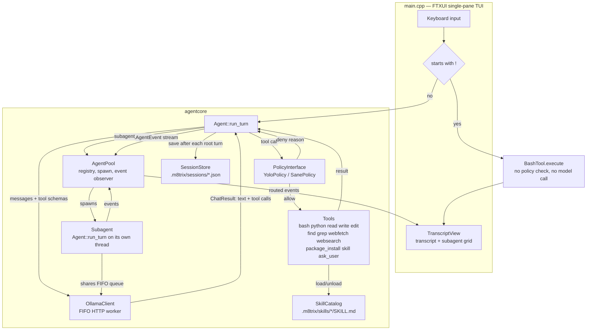
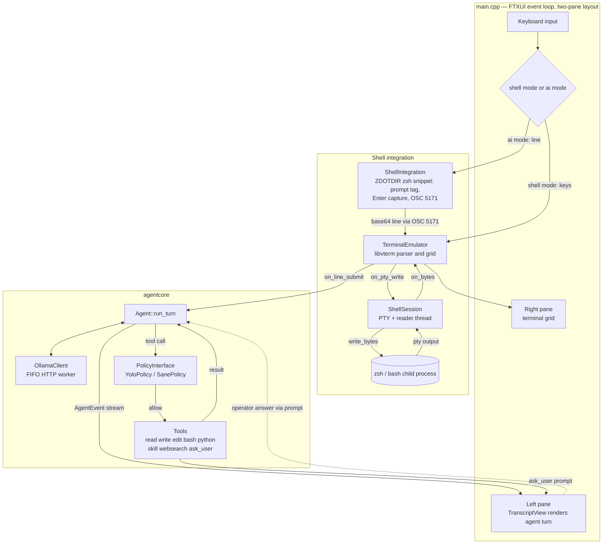

# m8trixparrot

Experiments in building AI agents in C++ on top of local Ollama models,
with terminal UIs built on [FTXUI](https://github.com/ArthurSonzogni/FTXUI).

## Layout

```
.
├── CMakeLists.txt          top-level build: fetches deps, adds src/
├── Makefile                convenience wrapper around cmake/make
└── src/
    ├── core/                shared library (agentcore): Ollama HTTP client, etc.
    │   ├── ollama_client.h/.cpp
    │   └── CMakeLists.txt
    └── apps/                one subdirectory per agent experiment
        ├── CMakeLists.txt   registers each experiment
        └── chat_tui/        first experiment: minimal FTXUI chat against Ollama
            ├── main.cpp
            └── CMakeLists.txt
```

Every experiment is its own executable target under `src/apps/<name>/`,
linked against the shared `agentcore` library. All built executables are
placed directly in `build/` (e.g. `build/chat_tui`) regardless of how deep
their source lives, so they're easy to find and run.

Communication with Ollama happens over HTTP via libcurl
(`src/core/ollama_client.{hpp,cpp}`), talking to Ollama's REST API
(`/api/chat`) with JSON bodies parsed via
[nlohmann/json](https://github.com/nlohmann/json).

## Adding a new experiment

1. Create `src/apps/<name>/` with a `main.cpp` and a `CMakeLists.txt`
   (copy `src/apps/chat_tui/CMakeLists.txt` as a starting point).
2. Add `add_subdirectory(<name>)` to `src/apps/CMakeLists.txt`.
3. `make build` — the new binary appears at `build/<name>`.

## Build

Dependencies: a C++20 compiler, CMake, `libcurl`, `libgit2`, and (for the
`m8trixsh` app only) `libvterm` — all system-provided; on macOS
`brew install libgit2 libvterm`. FTXUI, simdjson, pybind11, and CLI11 are
fetched automatically by CMake via `FetchContent`. When `libvterm` is absent
the build still works, it just skips `m8trixsh`.

```sh
make build       # configure (if needed) + build everything into build/
make run APP=chat_tui   # build, then run a specific app
make clean        # remove the build directory
make rebuild       # clean + build
```

Or drive CMake directly:

```sh
cmake -S . -B build -DCMAKE_BUILD_TYPE=Release
cmake --build build -j
```

## Running chat_tui

Requires a running [Ollama](https://ollama.com) server with a pulled model:

```sh
ollama pull llama3.2
build/chat_tui llama3.2                       # positional: model name
build/chat_tui --model llama3.2 --history /tmp/chat.txt  # named flags
build/chat_tui --help                         # list all options
```

Type a message and press Enter to send it; type `/quit` to exit.

## m8trixparrot

`m8trixparrot` is the coding agent this repo is named after: a single-pane
FTXUI chat TUI in front of a multi-step Ollama agent that can call tools
(`bash`, `python`, `read`/`write`/`edit`, `find`/`grep`, `webfetch`,
`websearch`, `package_install`, `skill`, `ask_user`) and spawn subagents for
independent subtasks. A line starting with `!` bypasses the agent entirely and
runs as a shell command (e.g. `!ls -al`).

### Architecture



A turn starts when the user submits a line that doesn't start with `!`:
`Agent::run_turn` loops model calls against `OllamaClient`'s FIFO queue,
gates each returned tool call through `PolicyInterface` before dispatching
it, and stops once the model replies with no more tool calls. Every step
emits an `AgentEvent` through the shared `AgentPool`, which stamps
agent/parent/depth and routes it to `TranscriptView`. Calling the
`subagent_create` tool spawns another `Agent` on its own thread — sharing the
same `OllamaClient` queue so concurrent model calls still serialize — whose
events nest under the parent in the transcript until `subagent_wait` joins it.
The root agent's result tree (not the full transcript) is saved to
`SessionStore` after each turn.

## Running m8trixsh

`m8trixsh` is an intelligent shell. It runs zsh in a VT100/xterm pane (colours,
`vim`, `htop`, `ssh`, job control) and adds an **AI mode** on the side. You
always type at the one shell prompt; a `[shell]` / `[m8trx]` tag on that prompt
shows where **Enter** goes, and **Shift+Tab** toggles it:

- **shell mode** (default): the line runs in the shell, exactly like a terminal.
- **ai mode**: the line goes to an Ollama agent that can `read`/`write`/`edit`
  files and run `bash`, and does not run in the shell. For anything that
  changes files the agent researches first, proposes a plan (which you answer
  at the prompt — the tag turns to `[m8trx?]`), writes a script into `~/bin`,
  asks you to approve it, then runs it. Toggle back to `[shell]` any time — the
  agent keeps working, and the AI pane pops open when it needs an answer.

```sh
brew install libvterm          # one-time prerequisite for this app
make run APP=m8trixsh           # or: build/m8trixsh --model qwen3.8:27b-mlx
```

The agent's replies and tool calls show in the left pane, which collapses to a
thin strip when there is no AI activity. `Ctrl+Alt+J`/`K` scroll it,
`Ctrl+Alt+H`/`L` resize it, `Ctrl+Alt+F` folds every tool call (all in ai
mode). The permission policy defaults to `yolo` — your approval of each script
before it runs is the safety gate; `--policy sane` confines writes to the
working directory and `/tmp`.

m8trixsh installs its own prompt and Enter-capture into a throwaway `ZDOTDIR`
that sources your real `~/.zshrc` first, so your aliases, `PATH`, and functions
still work. **The mode tag and ai-mode capture need zsh**; with a non-zsh
`$SHELL` the pane still works but stays in shell mode. AI-mode lines are never
added to your shell history.

Unlike `m8trixparrot`, `m8trixsh` reads its defaults from **`~/.m8shrc`** — a
shell-env-style file, one `KEY=VALUE` per line (`#` comments, optional `export`
and surrounding quotes). A CLI flag always overrides it.

```sh
# ~/.m8shrc
MODEL=qwen3.8:27b-mlx
POLICY=sane
ENABLE_WEB_SEARCH=1
SHELL=/bin/zsh
MODE_SWITCH_KEY=ctrl-o        # shift-tab (default) | tab | ctrl-] | ctrl-o | ctrl-\ | f12
PROMPT_FORMAT='%tag %F{green}➜%f  %F{cyan}%~%f %F{yellow}%git%f '
PROMPT_AI_TAG='%F{magenta}[m8trx]%f'
```

Recognized keys: `MODEL`, `POLICY`, `MAX_STEPS`, `NUM_CTX`, `SUMMARIZE_AT`,
`SKILLS_DIR`, `ENABLE_SKILLS`, `ENABLE_SUBAGENTS`, `ENABLE_PACKAGE_INSTALL`,
`ENABLE_WEB_SEARCH`, `SHELL`, `MODE_SWITCH_KEY`, `PROMPT_FORMAT`,
`PROMPT_SHELL_TAG`, `PROMPT_AI_TAG`, `PROMPT_ASK_TAG`. `MODE_SWITCH_KEY` rebinds
the shell/ai toggle; the default `shift-tab` matches any backtab (Shift+Tab, and
Ctrl/Opt+Shift+Tab where the terminal forwards one), which shadows zsh's
reverse-menu-complete while the toggle is live. `PROMPT_FORMAT` is the prompt
m8trixsh installs — ordinary zsh prompt syntax, with `%tag` (the
`[shell]`/`[m8trx]`/`[m8trx?]` indicator) and `%git` (a branch segment) added;
the `PROMPT_*_TAG` keys set what `%tag` expands to in each mode.

### Architecture



Shell-mode keystrokes go straight from `TerminalEmulator` to the `zsh` child
through `ShellSession`'s PTY, with `TerminalEmulator` parsing the output back
into a renderable grid. Ai-mode lines are instead captured by the zsh snippet
`ShellIntegration` installs (via a custom Enter binding that emits an OSC 5171
escape sequence), decoded by `TerminalEmulator`, and handed to the `Agent`,
which loops against `OllamaClient` and dispatches tool calls through
`PolicyInterface` before they run. The `ask_user` tool reuses the same prompt
to park the agent thread until the operator answers.

## Skills

`m8trixparrot` loads **skills** — reusable procedures for specific tasks — from
`.m8trix/skills/<name>/SKILL.md`, in the
[Agent Skills](https://agentskills.io) format (YAML frontmatter with `name` and
`description`, then a markdown body; supporting files under the skill directory).

Every turn the agent sees a catalog of each skill's name + description. It loads
one on demand with the `skill` tool (`skill` action `load` — the body enters the
conversation; read the skill's other files with `python`), and drops it with
`skill` action `unload` to reclaim context.

- `/skills` in the TUI lists the skills (and re-scans the directory).
- A skill whose frontmatter sets `metadata.command: "true"` is also
  `/its-name [args]` in the TUI; `metadata.argument-hint` documents the args.
- `metadata.requires` (space-separated names) records dependencies on other
  skills — shown in the catalog, not auto-loaded.
- `--skills-dir <path>` changes the location; `--no-skills` turns the system off.

`.m8trix/skills/` is tracked by git (unlike the rest of `.m8trix/`); the bundled
`todo-scan` skill is a working example.

## Web search

The `websearch` tool queries the web through the
[Parallel](https://parallel.ai) Search API and returns a numbered list of
results (title, URL, snippet). It needs a Parallel API key, taken from the
`PARALLEL_API_KEY` environment variable or, failing that, the first line of
`.m8trix/parallel_api_key` (gitignored — never commit the key). `PARALLEL_API_BASE`
overrides the API host for a proxy or a test double.

`websearch` is **off by default**; each app opts in from its own config:

- **m8trixparrot** — `"enable_web_search": true` in `<workdir>/.m8trix/settings.json`
- **m8trixsh** — `ENABLE_WEB_SEARCH=1` in `~/.m8shrc`

With no key configured the app prints a warning and `websearch` calls return an
error (the agent adapts). `make integration-test` includes live checks — a
direct API call and a full agent turn — when a key is present, and skips them
otherwise. Ad-hoc:

```sh
build/toolcall '{"name":"websearch","arguments":{"query":"...","limit":5}}'
```
